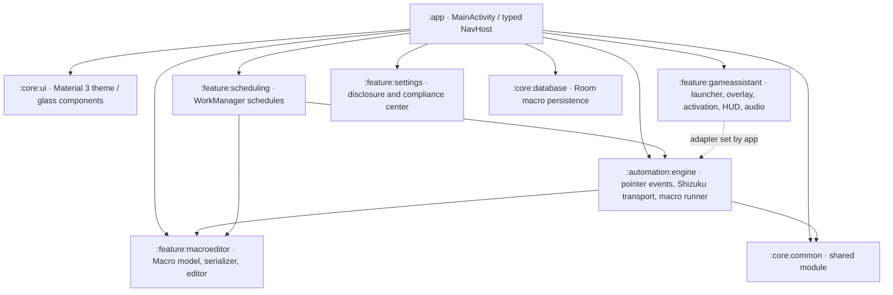
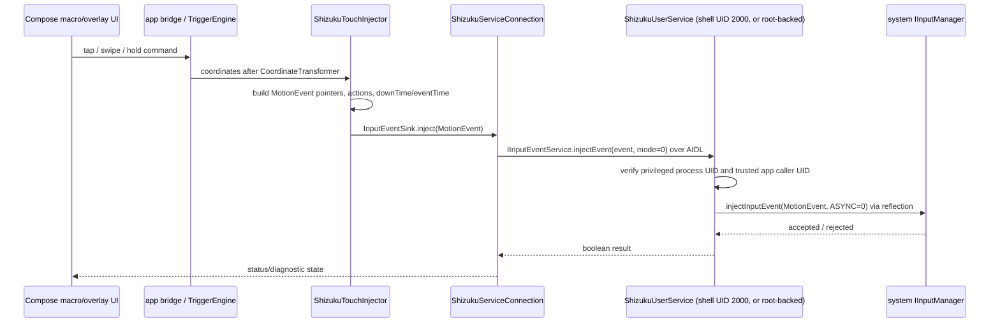

# Trigger architecture and handoff

## System overview

Trigger is a local-first Android app. Compose UI surfaces call Android platform APIs or the feature/automation adapters; no feature needs a remote service.

The app is the composition root and directly depends on feature modules, the automation engine, and core persistence/UI. The game-assistant feature exposes a `TouchDispatcher` seam; the app installs a TriggerEngine-backed dispatcher before starting the service. The automation engine depends on the macro schema module so it can execute typed steps. Scheduling persists schedule descriptors in app-private SharedPreferences and enqueues WorkManager requests; Room is currently used for macro entities/steps, while the editor's local catalog also keeps a preference-backed representation. No DataStore module is currently used.

## Touch injection sequence

`Binder.getCallingUid()` inside the shell service is expected to be the app UID because the app is the Binder client. It is therefore incorrect to require that *calling* UID to equal shell UID. The service instead validates `Process.myUid()` is shell/root and that the caller matches the UID captured from Shizuku's user-service context. The input system performs its own privileged permission checks. When context/UID capture or reflection is unavailable, the service fails closed.

## Data and privacy boundaries

| Data | Location / lifetime | Network behavior |
|---|---|---|
| Macro definitions and steps | Room `trigger.db`; the visual editor/catalog also has app-private preference storage | No upload path in app code |
| Schedule descriptors | App-private SharedPreferences; WorkManager database stores work requests/input | No network constraint or server callback is configured |
| Execution diagnostics | Sanitized, in-process `ExecutionRuntime`/`ExecutionLog` memory | Export only through Android SAF after user chooses a destination |
| Audio samples | Transient PCM arrays in the DSP worker | Not persisted or sent to a server |
| Permissions/activation state | Queried live from Android/ Shizuku | No telemetry collection implemented |

The app manifest does not request `INTERNET`; no HTTP, analytics, remote configuration, telemetry, or downloaded-code path is implemented in app source. Build tooling necessarily retrieves Gradle dependencies during development/CI; that is not runtime app telemetry. Android, Shizuku, and store services remain independent platform services. The app does not invoke arbitrary shell commands for remote code execution. Shizuku's UserService invokes only the framework input injection method by reflection; macro `LaunchAppStep` launches an installed package selected by the user.

### Threat model

- **Untrusted macro JSON:** Parse with kotlinx.serialization; reject malformed schemas. Macro launch steps can start an installed app. Do not import macros from untrusted sources without reviewing steps and target package.
- **Binder caller spoofing/leak:** Keep the UserService class and AIDL transport internal to the installed app; do not publish the transport as an exported Android service. Validate service process UID and client app UID on each call. Binder handles are capability-like; never write or log them.
- **Privileged event injection:** Only use Shizuku/root after explicit user authorization. Reject non-MotionEvent data and non-async modes. Framework/vendor rejection is surfaced rather than bypassed.
- **Reflection/API drift:** Resolve `ServiceManager`/`IInputManager` only in the shell/root UserService, catch unsupported API/vendor failures, and fail closed. Do not weaken hidden-API enforcement in the normal app process.
- **Sensitive permissions:** Show the disclosure before navigating to sensitive Android settings/runtime prompts. Users can revoke access in system settings. Usage access is optional in this build because automatic foreground-game monitoring is not wired.
- **Local data disclosure:** Logs are redacted and bounded in memory. SAF is the only diagnostic-file export; the user chooses the destination. App-private DB/preferences are removed by uninstall/data clear.
- **Availability / OEM behavior:** Android process limits, battery policies, cutouts, scaling, or blocked injection can stop the overlay. Recovery is documented in [RUNBOOK.md](RUNBOOK.md); do not work around platform security globally.

## Architecture decisions (ADRs)

### ADR-001 — Shizuku UserService for privileged input

**Status:** Accepted. **Decision:** Build MotionEvents in the app, send them over AIDL to a Shizuku UserService, and invoke the hidden input Binder only from its privileged process. **Why:** The ordinary app UID cannot call `INJECT_EVENTS`; a shell/root service provides a controlled permission boundary. **Trade-offs:** Shizuku must be running and authorized; hidden interface signatures vary by vendor/API; reflection errors fail closed. **Rejected:** Shell `input tap` subprocesses, which cannot maintain native multi-pointer lifecycles or low latency.

### ADR-002 — Local-first state and user-mediated export

**Status:** Accepted. **Decision:** Store macros in Room/app-private preferences, schedules in preferences plus WorkManager, keep execution logs in memory, and export diagnostics using SAF. **Why:** Avoid remote telemetry and broad storage permissions; users choose if/where logs leave app-private storage. **Trade-offs:** Clearing app data removes macros/schedules; users must preserve exports themselves. DataStore is not currently adopted.

### ADR-003 — WorkManager for resilient schedules

**Status:** Accepted. **Decision:** Use unique periodic WorkManager tasks with Android's 15-minute minimum and optional charging constraints. **Why:** System-managed deferrable work survives process death and observes battery constraints. **Trade-offs:** Execution time is inexact and OEM battery restrictions still apply; it is not a real-time scheduler.

### ADR-004 — Compose single-activity navigation

**Status:** Accepted. **Decision:** Use typed Navigation Compose routes and a shared Material 3 theme. **Why:** A single source of navigation state connects launcher, editor, schedules, permission center, and monitor. **Trade-offs:** Navigation serialization schema changes must be reviewed alongside route changes.

### ADR-005 — Explicit disclosure before sensitive access

**Status:** Accepted. **Decision:** Show a permission-specific prominent disclosure before opening Android permission/settings flows. **Why:** Permission rationale is visible at the point of use, not buried only in a policy document. **Trade-offs:** Additional user action; optional usage-access feature is labelled as not active in this build.
